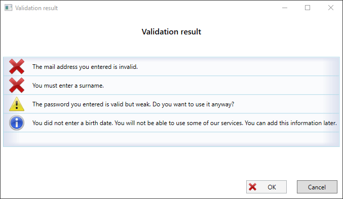

# Introduction

Ifp.Validation is a library for validating an object against a set of 
rules and encapsulating the validation result in an easily presentable form:



The library mimics the behavior of an compiler output:

* Don't stop at the first error, but process and collect all errors.
* Distinguish between *Information*, *Warning* and *Errors* severities and take the most severe error to decide about the overall outcome of a validation:
  * **Information** (circled blue 'i') Just a hint. The validation is still successful.
  * **Warning** (yellow exclamation mark) There might be a problem. Let the user decide whether this is serve or not.
  * **Error** (red 'x') There is an error and the validation failed. 

## Design goals

The library was created with the following design goals:
<dl>
    <dt>Clear focus</dt>
    <dd>
        Provide a library that can validate an object and be able to present the result of several validation rules at once
        by also providing a notion of validation rule violation severity.
    </dd>
    <dt><a href="https://en.wikipedia.org/wiki/Separation_of_concerns">Separation of concerns</a></dt>
    <dd>
        The libraray separates the <em>object to validate</em> from the validation logic. 
        There is no need for the <em>object to validate</em> to implement an interface or 
        to be annotated with attributes.
    </dd>
    <dt><a href="https://en.wikipedia.org/wiki/Single_responsibility_principle">Single responsibility principle</a></dt>
    <dd>
        The library distinguishes between the different validation steps:
        <dl>
            <dt>ValidationRule</dt>
            <dd>
                A small unit with a definitive purpose returning a <em>validation outcome</em> 
                that describes the result of the validation.
            </dd>
            <dt>ValidationOutcome</dt>
            <dd>
                An object providing a text description of the violation of a rule and a 
                <em>severity</em> of the violation. The severity can be <em>information</em>, 
                <em>warning</em> or <em>error</em> (see later for details). 
            </dd>
            <dt>Validator</dt>
            <dd>
                A class that takes one or more <em>ValidationRules</em> and combines them
                to produce a <em>ValidationSummary</em>.
            </dd>
            <dt>ValidationSummaryPresenter</dt>
            <dd>
                A service that takes a <em>ValidationSummary</em> and presents it to the user (see screenshot above).
            </dd>
        </dl>        
        This leads to great flexibility and a good testability of the validation rules.
    </dd>
    <dt><a href="https://de.wikipedia.org/wiki/Dependency_Injection">Dependency injection</a></dt>
    <dd>
        The library works best in combination with a <em>dependency injection framework</em>.
        The dependencies are expressed by constructor parameters (see the examples below).
    </dd>
    <dt>Reuse and combinability of validation rules</dt>
    <dd>
        Validation rules can easily be combined and reused even if the type of the object to validate
        is not of the type that the validation rule demands (see below for examples).
    </dd>
    <dt>Extensibility</dt>
    <dd>
        All validation steps can be used as entry points for own implementations and extensions.        
    </dd>
    <dt>Portable</dt>
    <dd>
        This library does not contain any presentation logic and can therefore used on a wide variety of platforms.
        A companion library for displaying a validation summary can be found at <a href="https://github.com/ifpanalytics/Ifp.Validation.WPF">github.com/ifpanalytics/Ifp.Validation.WPF</a>.  
    </dd>
</dl>


The following parts are not included in the library:

* No predefined validation rules, like *mandatory field*, *email address*, *Max length* and alike.
* No presentation logic. A WPF library with an [`IValidationSummaryPresentationService`](wiki/969daa1b-1461-94ea-de5b-490b353158fe) can
  be found at [github.com/ifpanalytics/Ifp.Validation.WPF](https://github.com/ifpanalytics/Ifp.Validation.WPF)

## How to use

The first step in the use of the library is to have an  *object to validate*:

```CS
public class RegisterNewUserModel
{
    public string EMail { get; set; }
    public string GivenName { get; set; }
    public string SurName { get; set; }
    public DateTime? BithDate { get; set; }
}
```

In its simplest form the validation can be performed like this:

```CS
bool IsRegisterNewUserModelValid(RegisterNewUserModel model)
{
    // Use the ValidationSummaryBuilder to build a ValidationSummary step by step.
    ValidationSummaryBuilder vsBuilder = new ValidationSummaryBuilder();
    // Validate the object and append as much ValidationOutcomes as you like.
    if (String.IsNullOrWhiteSpace(model.EMail))
        vsBuilder.Append("You must enter an email address".ToFailure(FailureSeverity.Error));
    if (model.BithDate == null)
        vsBuilder.Append("You did not enter a birth date. You will not be able to use some of our services.You can add this information later.".ToFailure(FailureSeverity.Information));
    // Build the summary and use an IValidationSummaryPresentationService to present the summary to the user.
    var summary = vsBuilder.ToSummary();
    var presenter = new ValidationSummaryPresentationService();
    // If the user clicks on 'OK' the ShowValidationSummary method returns true.
    var userResponse = presenter.ShowValidationSummary(summary);
    return userResponse;
}
```

To take full advantage of the library, the concerns (defining the rules, performing the validation, presenting the result) should be separated.
To do so one ore more validation rules are defined first:

```CS
public class BirthdateValidationRule : ValidationRule<RegisterNewUserModel>
{
    public override ValidationOutcome ValidateObject(RegisterNewUserModel objectToValidate)
    {
        // Use the ToFailure extension method for strings to create a ValidationOutcome.
        if (objectToValidate.BithDate == null)
            return "You did not enter a birth date. You will not be able to use some of our services.You can add this information later.".ToFailure(FailureSeverity.Information);
        // Return ValidationOutcome.Success to indicate success.
        return ValidationOutcome.Success;
    }
}

public class PasswordValidationRule : ValidationRule<RegisterNewUserModel>
{
    // Import other services per constructor injection if needed
    public PasswordValidationRule(IPasswordPolicyVerifier passwordPolicyVerifier)
    {
        PasswordPolicyVerifier=passwordPolicyVerifier;
    }

    protected IPasswordPolicyVerifier PasswordPolicyVerifier { get; }

    public override ValidationOutcome ValidateObject(RegisterNewUserModel objectToValidate)
    {
        if (objectToValidate.Password != objectToValidate.PasswordRepeated)
            return "The two passwords you entered are not the same.".ToFailure(FailureSeverity.Error);
        if (!PasswordPolicyVerifier.ConformsToPolicy(objectToValidate.Password))
            return "The password you entered does not conform to the password policy.".ToFailure(FailureSeverity.Error);
        if (PasswordPolicyVerifier.IsWeakPassword(objectToValidate.Password))
            return "The password you entered is valid but weak. Do you want to use it anyway?".ToFailure(FailureSeverity.Warning);
        return ValidationOutcome.Success;
    }
}
```

The rules can be combined to a set of validations:

```CS
public class RegisterNewUserValidator : RuleBasedValidator<RegisterNewUserModel>
{
    public RegisterNewUserValidator(PasswordValidationRule passwordValidationRule, BirthdateValidationRule birthdateValidationRule)
        : base(passwordValidationRule, birthdateValidationRule)
    {

    }
}
```

This validator can be used to produce a `ValidationSummary` and this summary can be presented to the user
(see the screen shot above for an example).

```CS
public class RegisterNewUserService: IRegisterNewUserService
{
    public RegisterNewUserService(RegisterNewUserValidator validator, IValidationSummaryPresentationService validationSummaryPresentationService)
    {
        Validator = validator;
        ValidationSummaryPresentationService = validationSummaryPresentationService;
    }

    protected IValidationSummaryPresentationService ValidationSummaryPresentationService { get; }
    protected RegisterNewUserValidator Validator { get; }

    public bool ValidateAndStoreNewUser(RegisterNewUserModel model)
    {
        var summary = Validator.Validate(model);
        if (!ValidationSummaryPresentationService.ShowValidationSummary(summary))
            // The user pressed 'Cancel'.
            return false;
        // Logic to store the model to the database.
        return true;
    }
}
```

To construct a new `RegisterNewUserService` all the services need to be resolved:

```CS
new RegisterNewUserService(new RegisterNewUserValidator(new PasswordValidationRule(new PasswordPolicyVerifier()), new BirthdateValidationRule()), new ValidationSummaryPresentationService()); 
```

This cumbersome work is best delegated to a dependency injection framework like [Ninject](http://www.ninject.org/) or [Unity](https://github.com/unitycontainer/unity).

## Understanding `ValidationOutcome`

The `ValidationOutcome` can be constructed either by 
* Calling  the `ToFailure` extension method for `string`.
* Accessing the `ValidationOutcome.Success` property.

The `ToFailure` method takes a `FailureSeverity` enum as parameter. This enum
represents the three predefined severities (information, warning and error).

To create a new severity (e.g. Question) `ValidationOutcome` must be used as a base class. 

## Reusing `ValidationRule`

The `RuleBasedValidator<T>` can be used to combine several rules. There are several mechanism available
to combine rules even if the type parameter `<T>` of `IValidationRule<T>` is not the same as `RuleBasedValidator<T>`.

### [Contravariant](https://msdn.microsoft.com/en-us/library/dd799517.aspx) rules

A `RuleBasedValidator<T>` accepts a `ValidationRule<T>` if the type parameter of the 
validation rule is a super-class of the type parameter of the `RuleBasedValidator<T>`:

```CS
public class AnimalMustBeMaleRule : ValidationRule<Animal> { ... }

// The 'Dog' validator accepts rules for 'Animals'.
var validator = new RuleBasedValidator<Dog>(new AnimalMustBeMaleRule());
```

### Converting the type using `ValidationRuleDelegate<T>`

The `ValidationRuleDelegate<T>` class can be used to convert an *object to validate*
in the appropriate type for a validation rule. If there is for instance a validation rule, that
can decide whether a string is a valid email address or not, this rule can be used by a `RuleBasedValidator<T>`
in the following manner:

```CS
// The validation rules expects a string to validate
class EMailAddressValidationRule : ValidationRule<string>

// The validator expects a RegisterNewUserModel.
class ValidationRuleDelegateExample : RuleBasedValidator<RegisterNewUserModel>
{
    
    public ValidationRuleDelegateExample(EMailAddressValidationRule emailAddressValidationRule) :
        base(new ValidationRuleDelegate<RegisterNewUserModel>(model => emailAddressValidationRule.ValidateObject(model.EMail)))
        {

        }
}

```

### Applying `ValidationRule<T>` to an `IEnumerable<T>` of objects

The `CollectionValidator<T>` allows to wrap an existing `RuleBasedValidator<T>` 
to support the validation of an `IEnumerable<T>`. In the example below a `DogCollectionValidator`
is constructed by either taking the validator for a single dog or by taking rules
for a single dog.

```CS
// Some rules
class DogMustBeOlderThan2Years: ValidationRule<Dog> { ... }
class DogMustBeMale : ValidationRule<Dog> { ... }

// A validator for a single 'dog'
class DogValidator : RuleBasedValidator<Dog>
{
    public DogValidator(DogMustBeOlderThan2Years rule1, DogMustBeMale rule2) :
        base(rule1, rule2)
    {
    }
}

// A CollectionValidator that can validate an IEnumerable<Dog>
class DogCollectionValidator : CollectionValidator<Dog>
{
    // Wrap an existing RuleBasedValidator 
    public DogCollectionValidator(DogValidator dogValidator) : 
        base(dogValidator)
    {
    }
        
    // Or construct a CollectionValidator out of rules 
    public DogCollectionValidator(DogMustBeOlderThan2Years rule1, DogMustBeMale rule2) :
        base(rule1, rule2)
    {
    }
}

// Use the validator
var dogs = new Dog[] { new Dog(), new Dog() };
var summary = validator.ValidateCollection(dogs);
```

## The `CausesValidationProcessToStop` property


## Further documentation

[Wiki](https://github.com/ifpanalytics/Ifp.Validation/wiki)

## How to get
